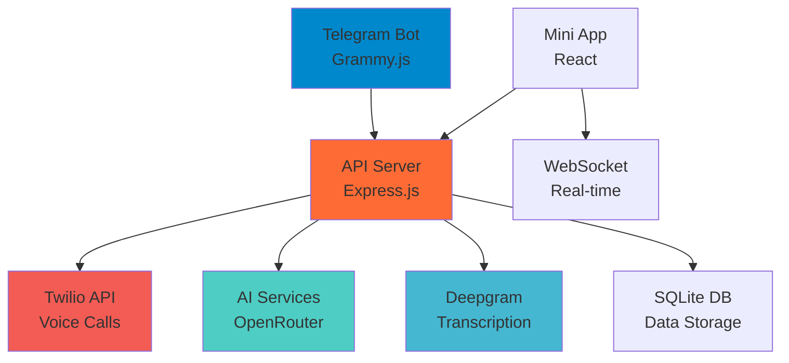

# VoicedNut - AI Voice Call System 🤖📞

[](https://nodejs.org/)
[](LICENSE)
[](https://core.telegram.org/bots)
[](https://reactjs.org/)
[](https://www.twilio.com/)

A comprehensive AI-powered voice call system with a Telegram bot interface and a modern React mini-app. Make intelligent voice calls using Twilio, leverage AI through OpenRouter APIs, and get real-time transcription with Deepgram.

## 🌟 Features

### 🤖 Core Features

- AI-powered voice conversations with customizable agents
- Outbound call management and monitoring
- Real-time transcription and conversation logging
- Call analytics, summaries, and detailed reporting
- Multi-user authorization system with role-based access
- Admin controls for user and system management
- Complete call history with searchable transcripts
- Real-time notifications via Telegram webhooks
- Custom AI prompts and agent personalities

### 📱 Mini App Features

- Modern React-based Telegram Mini App
- Real-time call monitoring
- Advanced call settings
- Role-based UI components
- WebSocket integration
- Responsive Telegram theme integration
- Admin dashboard with system controls

### 🎯 Admin Features

- User management system
- System health monitoring
- Call analytics dashboard
- Real-time status updates
- Advanced configuration controls
- Deployment monitoring

## 🏗️ System Architecture



## 🚀 Quick Start

### Prerequisites

- Node.js 16+
- [Telegram Bot Token](https://t.me/botfather)
- [Twilio Account](https://console.twilio.com/) (Account SID, Auth Token, Phone Number)
- [OpenRouter API Key](https://openrouter.ai/)
- [Deepgram API Key](https://deepgram.com/)

### Installation

1. **Clone the repository**

   ```bash
   git clone https://github.com/ednutlabs/voicednut.git
   cd voicednut
   ```

1. **Set up API Server**

   ```bash
   cd api
   npm install
   cp .env.example .env
   # Edit .env with your credentials
   npm start
   ```

1. **Set up Bot**

   ```bash
   cd ../bot
   npm install
   cp .env.example .env
   # Edit .env with your credentials
   npm start
   ```

1. **Start using the bot**

- Message your bot on Telegram
- Use `/start` to begin
- Use `/call` to make your first AI call

## ⚙️ Configuration

### API Server Configuration (`api/.env`)

```env
# Twilio Configuration
TWILIO_ACCOUNT_SID=ACxxxxxxxxxxxxxxxxxxxxxxxxxxxxxxxx
TWILIO_AUTH_TOKEN=your_auth_token
FROM_NUMBER=+1234567890

# Server Configuration
PORT=3000
SERVER=your-domain.com

# OpenRouter AI Configuration
OPENROUTER_API_KEY=sk-or-v1-xxx
OPENROUTER_MODEL=meta-llama/llama-3.1-8b-instruct:free
YOUR_SITE_URL=http://localhost:3000
YOUR_SITE_NAME=Voice Call Bot

# Deepgram Configuration
DEEPGRAM_API_KEY=your_deepgram_key
VOICE_MODEL=aura-asteria-en

# Optional Features
RECORDING_ENABLED=false
TELEGRAM_BOT_TOKEN=your_telegram_bot_token
```

### Bot Configuration (`bot/.env`)

```env
BOT_TOKEN=1234567890:ABCdefGHIjklMNOpqrsTUVwxyz
ADMIN_TELEGRAM_ID=123456789
ADMIN_TELEGRAM_USERNAME=your_username
API_BASE=http://localhost:3000
```

## 📖 API Documentation

### Core Endpoints

#### Health Check

```http
GET /health
```

#### Make Outbound Call

```http
POST /outbound-call
Content-Type: application/json

{
  "number": "+1234567890",
  "prompt": "You are a friendly sales assistant...",
  "first_message": "Hello! How can I help you today?",
  "user_chat_id": "123456789"
}
```

#### Get Call Details

```http
GET /api/calls/{call_sid}
```

#### List Recent Calls

```http
GET /api/calls?limit=20
```

### Database Schema

<details>
<summary>Click to view database tables</summary>

#### Calls Table

```sql
CREATE TABLE calls (
    id INTEGER PRIMARY KEY AUTOINCREMENT,
    call_sid TEXT UNIQUE NOT NULL,
    phone_number TEXT NOT NULL,
    status TEXT DEFAULT 'initiated',
    duration INTEGER,
    prompt TEXT,
    first_message TEXT,
    call_summary TEXT,
    ai_analysis TEXT,
    user_chat_id TEXT,
    created_at DATETIME DEFAULT CURRENT_TIMESTAMP,
    started_at DATETIME,
    ended_at DATETIME
);
```

#### Transcripts Table

```sql
CREATE TABLE transcripts (
    id INTEGER PRIMARY KEY AUTOINCREMENT,
    call_sid TEXT NOT NULL,
    speaker TEXT NOT NULL, -- 'user' or 'ai'
    message TEXT NOT NULL,
    timestamp DATETIME DEFAULT CURRENT_TIMESTAMP,
    interaction_count INTEGER,
    FOREIGN KEY(call_sid) REFERENCES calls(call_sid)
);
```

</details>

## 🤖 Bot Commands

### Basic Commands

- `/start` - Start or restart the bot
- `/call` - Start a new voice call
- `/transcript <call_sid>` - Get call transcript
- `/calls [limit]` - List recent calls
- `/health` - Check bot and API health
- `/guide` - Show detailed usage guide
- `/help` - Show available commands
- `/menu` - Show quick action buttons

### Admin Commands

- `/adduser` - Add new authorized user
- `/promote` - Promote user to admin
- `/removeuser` - Remove user access
- `/users` - List all authorized users
- `/status` - Full system status check
- `/test_api` - Test API connection

## 📁 Project Structure

```
voice-call-bot/
├── api/                    # API Server (Express.js)
│   ├── app.js             # Main API application
│   ├── routes/            # API route handlers
│   │   ├── gpt.js         # AI integration
│   │   ├── stream.js      # Audio streaming
│   │   ├── transcription.js # Speech-to-text
│   │   ├── tts.js         # Text-to-speech
│   │   └── status.js      # Webhook service
│   ├── db/                # Database management
│   └── functions/         # AI function calling
│
├── bot/                   # Telegram Bot (Grammy.js)
│   ├── bot.js            # Main bot application
│   ├── commands/         # Bot command handlers
│   │   ├── call.js       # Voice call functionality
│   │   ├── transcript.js # Transcript management
│   │   ├── api.js        # API testing
│   │   └── ...
│   ├── db/               # Bot database
│   └── utils/            # Utility functions
│
└── README.md             # This documentation
```

## 🔧 Development

### Local Development

```bash
# Terminal 1 - API Server
cd api && npm run dev

# Terminal 2 - Bot
cd bot && npm run dev
```

### Production Deployment

#### Using PM2

```bash
npm install -g pm2

# Start services
cd api && pm2 start npm --name "voice-api" -- start
cd bot && pm2 start npm --name "voice-bot" -- start

# Save configuration
pm2 save && pm2 startup
```

#### Using Docker

```dockerfile
FROM node:16-alpine
WORKDIR /app
COPY package*.json ./
RUN npm install
COPY . .
EXPOSE 3000
CMD ["npm", "start"]
```

## 🎯 Usage Examples

### Making Your First Call

1. **Start the bot**: Send `/start` to your bot
1. **Initiate a call**: Use `/call` command
1. **Enter details**:

- Phone number: `+1234567890`
- AI prompt: `"You are a friendly customer service agent"`
- First message: `"Hello! How can I help you today?"`

1. **Monitor progress**: Receive real-time notifications
1. **Get transcript**: Use `/transcript <call_sid>` after the call

### AI Model Configuration

Available free models through OpenRouter:

- `meta-llama/llama-3.1-8b-instruct:free` (default)
- `microsoft/wizardlm-2-8x22b`
- `google/gemma-2-9b-it:free`
- `qwen/qwen-2-7b-instruct:free`

### Voice Models (Deepgram)

Available TTS voices:

- `aura-asteria-en` - Friendly female (default)
- `aura-orion-en` - Friendly male
- `aura-luna-en` - Warm female
- `aura-arcas-en` - Professional male
- And many more…

## 🛠️ Troubleshooting

<details>
<summary>Common Issues & Solutions</summary>

### Bot not responding

- ✅ Check bot token in `.env`
- ✅ Verify bot is running with `npm start`
- ✅ Ensure user is authorized

### API connection failed

- ✅ Check API server is running
- ✅ Verify `API_BASE` URL in bot `.env`
- ✅ Test with `/test_api` command

### Calls not working

- ✅ Verify Twilio credentials
- ✅ Check phone number has voice capabilities
- ✅ Ensure webhook URL is accessible
- ✅ Use ngrok for local testing: `ngrok http 3000`

### AI responses not working

- ✅ Check OpenRouter API key
- ✅ Verify model name and availability
- ✅ Ensure sufficient credits

</details>

## 🔒 Security

- User authorization required for all operations
- Admin-only commands protected
- Input validation for all user inputs
- Secure phone number format validation
- Protected sensitive information in logs
- Webhook signature verification

## 📊 Monitoring

### Health Checks

- API: `GET /health`
- Bot: `/health` command
- Admin: `/status` command

### Logging

- Structured logging with timestamps
- Error tracking and debugging
- Call analytics and metrics
- Performance monitoring

## 🤝 Contributing

1. Fork the repository
1. Create a feature branch (`git checkout -b feature/amazing-feature`)
1. Commit your changes (`git commit -m 'Add amazing feature'`)
1. Push to the branch (`git push origin feature/amazing-feature`)
1. Open a Pull Request

## 📝 License

This project is licensed under the MIT License - see the <LICENSE> file for details.

## 🙋‍♂️ Support

- 📖 **Documentation**: Check this README and inline code comments
- 🐛 **Issues**: [GitHub Issues](https://github.com/yourusername/voice-call-bot/issues)
- 💬 **Discussions**: [GitHub Discussions](https://github.com/yourusername/voice-call-bot/discussions)
- 📧 **Contact**: Your contact information

## 🎉 Acknowledgments

- [Twilio](https://www.twilio.com/) for voice communication infrastructure
- [OpenRouter](https://openrouter.ai/) for AI model access
- [Deepgram](https://deepgram.com/) for speech services
- [Grammy](https://grammy.dev/) for Telegram bot framework
- All contributors who helped build this project

## 📊 Project Status

- ✅ **Stable**: Core functionality working
- 🔄 **Active Development**: Regular updates and improvements
- 🐛 **Bug Reports**: Welcome and addressed promptly
- 🚀 **Feature Requests**: Open to new ideas and suggestions

---

<div align="center">

**⭐ If you find this project helpful, please consider giving it a star! ⭐**

[Report Bug](https://github.com/yourusername/voice-call-bot/issues) · [Request Feature](https://github.com/yourusername/voice-call-bot/issues) · [Contribute](CONTRIBUTING.md)

</div>
